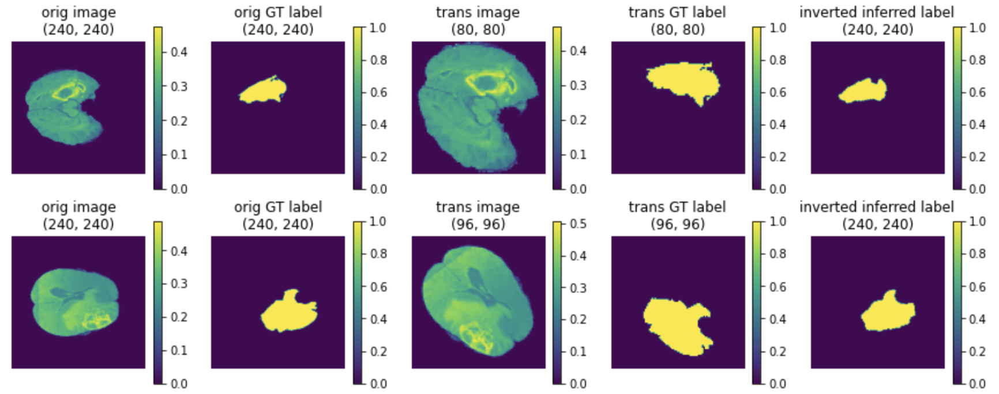
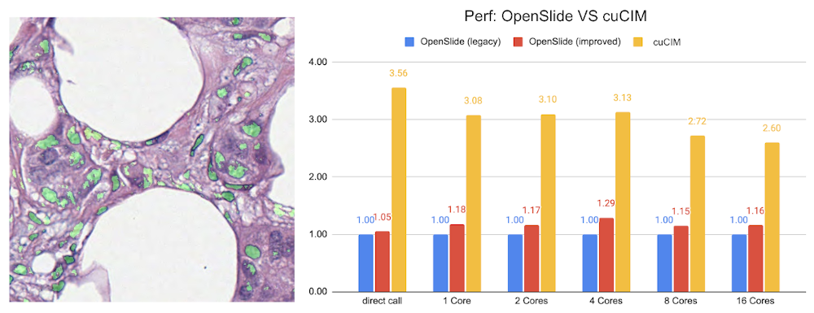
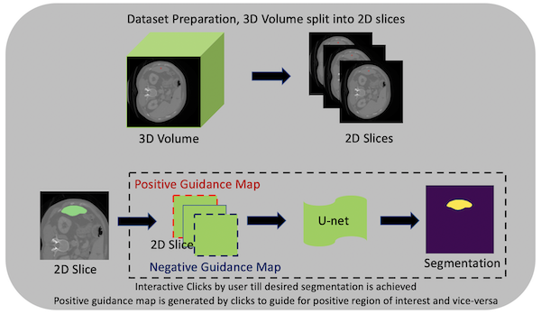
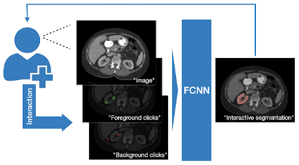

# What's new in 0.5.0 🎉

## Invert spatial transforms and test-time augmentations
It is often desirable to invert the previously applied spatial transforms (resize, flip, rotate, zoom, crop, pad, etc.) with the deep learning workflows, for example, to resume to the original imaging space after processing the image data in a normalized data space.  We enhance almost all the spatial transforms with an `inverse` operation and release this experimental feature in v0.5.0. Users can easily invert all the spatial transforms for one transformed data item or a batch of data items. It also can be achieved within the workflows by using the `TransformInverter` handler.

If the pipeline includes random transformations, users may want to observe the effect that these transformations have on the output. The typical approach is that we pass the same input through the transforms multiple times with different random realizations. Then use the inverse transforms to move all the results to a common space, and calculate the metrics. MONAI provided `TestTimeAugmentation` for this feature, which by default will calculate the `mode`, `mean`, `standard deviation` and `volume variation coefficient`.

[Invert transforms and TTA tutorials](https://github.com/Project-MONAI/tutorials/blob/master/modules/inverse_transforms_and_test_time_augmentations.ipynb) introduce details about the API with examples.

(1) The last column is the inverted data of model output:

(2) The TTA results of `mode`, `mean` and `standard deviation`:

## Lesion detection in digital pathology
MONAI starts to support digital pathology deep learning tasks. The initial [implementation](https://github.com/Project-MONAI/MONAI/tree/master/monai/apps/pathology) of the pathology detection components includes:
- Efficient whole slide imaging IO with NVIDIA cuCIM library
- Patch-based sampling and training strategies with the SmartCache mechanism
- FROC measurements for lesion detection
- Probabilistic post-processing for lesion ROIs.

## DeepGrow modules for interactive segmentation
Towards an interactive workflow with manual input during training and inference, 
[a reimplementation](https://github.com/Project-MONAI/MONAI/tree/master/monai/apps/deepgrow) of the DeepGrow components is included in this release.
DeepGrow is a deep learning based semi-automated segmentation approach that aims to be a "smart" interactive tool for regions of interest delineation in medical images.

An end-to-end example is presented at [`project-monai/tutorials`](https://github.com/Project-MONAI/tutorials/tree/master/deepgrow/ignite).

## Learning-based image registration
Starting from v0.5.0, MONAI provides experimental features for building learning-based 2D/3D registration workflows. These include image similarity measures as loss functions, bending energy as model regularization, network architectures, warping modules. The components can be used to build the major unsupervised and weakly-supervised algorithms.

The following figure shows the registration of CT images acquired at different time points for a single patient using MONAI:

## Various usability improvements
### IO factory for medical image formats
Many popular image formats exist in the medical domain, and they are quite different with rich metadata information. To easily handle different medical image formats in the same pipeline, [MONAI provides `LoadImage` transform](https://github.com/Project-MONAI/tutorials/blob/master/modules/load_medical_images.ipynb), which can automatically choose image readers based on the supported suffixes and in the below priority order:
- User-specified reader at runtime when call this loader.
- Registered readers from the latest to the first in list.
- Default readers: (nii, nii.gz -> NibabelReader), (png, jpg, bmp -> PILReader), (npz, npy -> NumpyReader), (others -> ITKReader).

The `ImageReader` API is quite straight-forward, users can easily extend for their own customized image readers.

With these pre-defined image readers, MONAI can load images in formats: `NIfTI`, `DICOM`, `PNG`, `JPG`, `BMP`, `NPY/NPZ`, etc.

### Save transform data into NIfTI or PNG files
To convert images into files or debug the transform chain, MONAI provides `SaveImage` transform. Users can inject this transform into the transform chain to save the results.

### Automatically ensure `channel-first` data shape
Medical images have different shape formats. They can be `channel-last`, `channel-first` or even `no-channel`. We may, for example, want to load several `no-channel` images and stack them as `channel-first` data. To improve the user experience, MONAI provided an `EnsureChannelFirst` transform to automatically detect data shape according to the meta information and convert it to the `channel-first` format consistently.

### Network architectures
Various ready-to-use architectures with pretrained model weights from `torch.hub`.

### Result writing
Currently MONAI supports writing the model outputs as NIfTI files or PNG files for segmentation tasks, and as CSV files for classification tasks. And the writers can restore the data spacing, orientation or shape according to the `original_shape` or `original_affine` information from the input image.

A rich set of formats will be supported soon, along with relevant statistics and evaluation metrics automatically computed from the outputs.

### Transfer learning for different input / output classes
`Transfer-learning` is a very common and efficient training approach, especially in the medical-specific domain where obtaining large datasets for training can be difficult. So transfer-learning from a pre-trained checkpoint can significantly improve the model metrics and shorten training time.

MONAI provided `CheckpointLoader` to load a checkpoint for the workflow before training, and it allows some `layer names` of current network don't match the checkpoint, or some `layer shapes` don't match the checkpoint, which can be useful if the current task has different input image classes or output classes.

### C++/CUDA optimized modules
To accelerate some heavy computation progress, C++/CUDA implementation can be an impressive method, which usually brings even hundreds of times faster performance. MONAI contains some C++/CUDA optimized modules, like `Resampler`, `Conditional random field (CRF)`, `Fast bilateral filtering using the permutohedral lattice`, and fully support C++/CUDA programs in CI/CD and building package.
